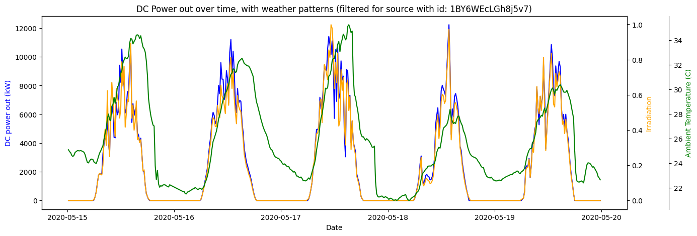
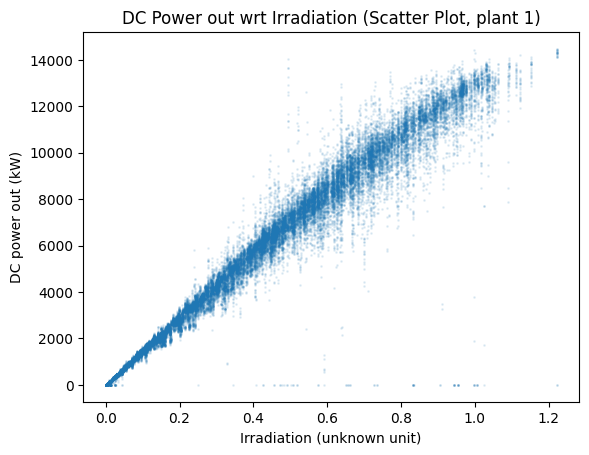
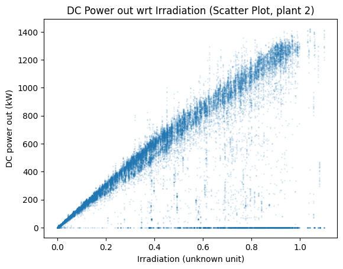

# Week 1 Progress & Notes:

## Task 1: Loading data

```python
power_data_1 = pd.read_csv("Plant_1_Generation_Data.csv")
weather_data_1 = pd.read_csv("Plant_1_Weather_Sensor_Data.csv")
power_data_2 = pd.read_csv("Plant_2_Generation_Data.csv")
weather_data_2 = pd.read_csv("Plant_2_Weather_Sensor_Data.csv")

# Only this file has a different date time format for some reason
power_data_1['DATE_TIME'] = pd.to_datetime(power_data_1['DATE_TIME'], format="%d-%m-%Y %H:%M") 
power_data_2['DATE_TIME'] = pd.to_datetime(power_data_2['DATE_TIME'], format="%Y-%m-%d %H:%M:%S")

weather_data_1['DATE_TIME'] = pd.to_datetime(weather_data_1['DATE_TIME'], format="%Y-%m-%d %H:%M:%S")
weather_data_2['DATE_TIME']= pd.to_datetime(weather_data_2['DATE_TIME'], format="%Y-%m-%d %H:%M:%S")

# Merge power and weather data simply via concatenation
power_data = pd.concat([power_data_1, power_data_2])
weather_data = pd.concat([weather_data_1, weather_data_2])
```

Loading data mostly involved reading the data files and doing some simple preparation such as converting the dates and times properly. 

Will get into why I have seperate data for plants 1 and 2 later, in task 3.

```python
# Filter for specific columns because of duplicates and unneeded columns
power_data_1 = power_data_1[['DATE_TIME', 'DC_POWER', 'SOURCE_KEY', 'PLANT_ID']]
weather_data_1 = weather_data_1[['DATE_TIME', 'IRRADIATION', 'AMBIENT_TEMPERATURE', 'MODULE_TEMPERATURE']]

power_data_2 = power_data_2[['DATE_TIME', 'DC_POWER', 'SOURCE_KEY', 'PLANT_ID']]
weather_data_2 = weather_data_2[['DATE_TIME', 'IRRADIATION', 'AMBIENT_TEMPERATURE', 'MODULE_TEMPERATURE']]

# Merge the power and weather data based on the date and time
merged_data_1 = pd.merge(power_data_1, weather_data_1, on='DATE_TIME', how='inner')
merged_data_2 = pd.merge(power_data_2, weather_data_2, on='DATE_TIME', how='inner')

merged_data = pd.concat([merged_data_1, merged_data_2])

display(merged_data)
```

Result:

|       | DATE_TIME           | DC_POWER | SOURCE_KEY      | PLANT_ID | IRRADIATION | AMBIENT_TEMPERATURE | MODULE_TEMPERATURE |
| ----- | ------------------- | -------- | --------------- | -------- | ----------- | ------------------- | ------------------ |
| 0     | 2020-05-15 00:00:00 | 0.0      | 1BY6WEcLGh8j5v7 | 4135001  | 0.0         | 25.184316           | 22.857507          |
| 1     | 2020-05-15 00:00:00 | 0.0      | 1IF53ai7Xc0U56Y | 4135001  | 0.0         | 25.184316           | 22.857507          |
| 2     | 2020-05-15 00:00:00 | 0.0      | 3PZuoBAID5Wc2HD | 4135001  | 0.0         | 25.184316           | 22.857507          |
| 3     | 2020-05-15 00:00:00 | 0.0      | 7JYdWkrLSPkdwr4 | 4135001  | 0.0         | 25.184316           | 22.857507          |
| 4     | 2020-05-15 00:00:00 | 0.0      | McdE0feGgRqW7Ca | 4135001  | 0.0         | 25.184316           | 22.857507          |
| ...   | ...                 | ...      | ...             | ...      | ...         | ...                 | ...                |
| 67693 | 2020-06-17 23:45:00 | 0.0      | q49J1IKaHRwDQnt | 4136001  | 0.0         | 23.202871           | 22.535908          |
| 67694 | 2020-06-17 23:45:00 | 0.0      | rrq4fwE8jgrTyWY | 4136001  | 0.0         | 23.202871           | 22.535908          |
| 67695 | 2020-06-17 23:45:00 | 0.0      | vOuJvMaM2sgwLmb | 4136001  | 0.0         | 23.202871           | 22.535908          |
| 67696 | 2020-06-17 23:45:00 | 0.0      | xMbIugepa2P7lBB | 4136001  | 0.0         | 23.202871           | 22.535908          |
| 67697 | 2020-06-17 23:45:00 | 0.0      | xoJJ8DcxJEcupym | 4136001  | 0.0         | 23.202871           | 22.535908          |

136472 rows × 7 columns

## Task 2: Looking for basic trends graphically

```python
# Pick a date range, I just did the first 5 days
START_DATE = pd.to_datetime("2020-05-15 00:00:00")
END_DATE = pd.to_datetime("2020-05-20 00:00:00")
l
# Pick an inverter, I just did the first one
INVERTER_ID = "1BY6WEcLGh8j5v7"

# Filter for the specific conditions above
one_inverter_5_day = merged_data[
    (merged_data['SOURCE_KEY'] == INVERTER_ID) &
    (merged_data['DATE_TIME'] > START_DATE) &
    (merged_data['DATE_TIME'] < END_DATE)
]

fig, ax = plt.subplots(figsize = (15, 5))
ax.set_title(f'DC Power out over time, with weather patterns (filtered for source with id: {INVERTER_ID})')

# DC Power out as main variable
color = 'blue'
ax.plot(one_inverter_5_day.DATE_TIME, one_inverter_5_day.DC_POWER, color = color)
ax.set_xlabel('Date')
ax.set_ylabel('DC power out (kW)', color = color)

# Irradiation as second 
color = 'orange'
ax2 = ax.twinx()
ax2.plot(one_inverter_5_day.DATE_TIME, one_inverter_5_day.IRRADIATION, color = color)
ax2.set_ylabel('Irradiation', color = color)

# Ambient temperature as third variable
color = 'green'
ax3 = ax.twinx()
ax3.plot(one_inverter_5_day.DATE_TIME, one_inverter_5_day.AMBIENT_TEMPERATURE, color = color)
ax3.set_ylabel('Ambient Temperature (C)', color = color)
ax3.spines['right'].set_position(('outward', 60))

plt.show()
```



### Observations:

- General solar power trend is there, the graph fits the expected arc throughout daytime as sunlight increases and decreases

- DC power closely tracks irradiation

- It looks like total output dropped along with temperature on May 18, they might have a relationship

### Challenges:

- Quite hard to figure out how to get the graph dimensions right, autoscale was horrible

- ```twinx()``` graphs y axis labels over each other, so I had to push the ambient temperature label out   

## Task 3: Looking for anomolies

```python
# Simple scatter plots, small points and low alpha because of the amount of data
fig_1, axes_1 = plt.subplots()
axes_1.scatter(merged_data_1.IRRADIATION, merged_data_1.DC_POWER, alpha=0.1, s=1)
axes_1.set_title("DC Power out wrt Irradiation (Scatter Plot, plant 1)")
axes_1.set_xlabel("Irradiation (unknown unit)")
axes_1.set_ylabel("DC power out (kW)")

fig_2, axes_2 = plt.subplots()
axes_2.scatter(merged_data_2.IRRADIATION, merged_data_2.DC_POWER, alpha=0.1, s=1)
axes_2.set_title("DC Power out wrt Irradiation (Scatter Plot, plant 2)")
axes_2.set_xlabel("Irradiation (unknown unit)")
axes_2.set_ylabel("DC power out (kW)")

plt.show()
```





### Observations:

- DC Power from plant 1 is almost exactly 10 times DC Power from plant 2 
  
  - Might consider normalizing to percent of max power

- Trendline is pretty linear, as irradiation goes up, so does the deviation for both plants

- Plant 1 is pretty clean, however you can still spot some outliers which are oddly low, or zero.

- Plant 2 has a lot more of these; there are a lot more datapoints that have zero dc power but a significant amount of irradiation

### Challenges:

- Because of the data range difference, I graphed the two plants seperately
  
  - Otherwise DC Power of plant 2 would take up 1/10th the vertical height and I could not tell much

### Finding occurences of the most common anomaly:

```python
# Filter for when there is no power but irradiation is significant (likely equipment failure)
filtered_for_error = merged_data[(merged_data['DC_POWER'] == 0.0) & (merged_data['IRRADIATION'] > 0.5)]

# Get a list of all the timestamps
timestamps = filtered_for_error[['DATE_TIME']]

# Convienient form is a list of times and how many inverters were failed at that time
ts_count = timestamps.groupby(timestamps.columns.tolist(), as_index=False).size()
display(ts_count)
```

|     | DATE_TIME           | size |
| --- | ------------------- | ---- |
| 0   | 2020-05-15 09:45:00 | 4    |
| 1   | 2020-05-15 10:00:00 | 4    |
| 2   | 2020-05-15 10:15:00 | 7    |
| 3   | 2020-05-15 10:30:00 | 7    |
| 4   | 2020-05-15 10:45:00 | 7    |
| ... | ...                 | ...  |
| 531 | 2020-06-15 14:00:00 | 2    |
| 532 | 2020-06-16 11:45:00 | 4    |
| 533 | 2020-06-16 12:00:00 | 3    |
| 534 | 2020-06-16 12:45:00 | 1    |
| 535 | 2020-06-16 14:30:00 | 22   |

536 rows × 2 columns

Note: Times without the conditions above are not included

### Observations:

- None for now, might do more with it later

[Link to notebook](./SolarPowerData.ipynb)

Note: Does contain code from the next week, however I forgot to make a copy of the code state from only week 1
