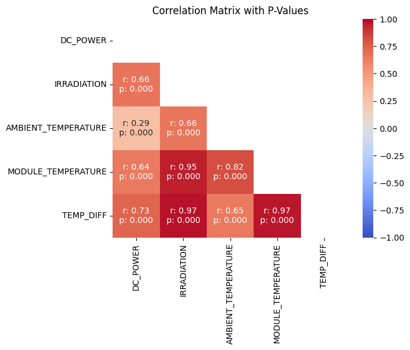
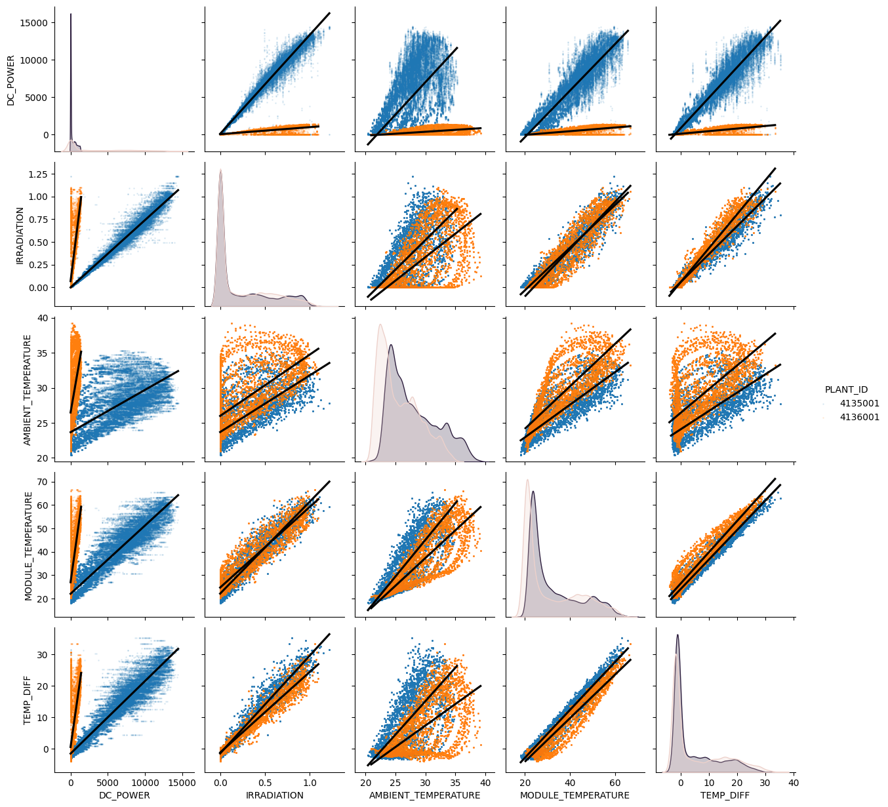
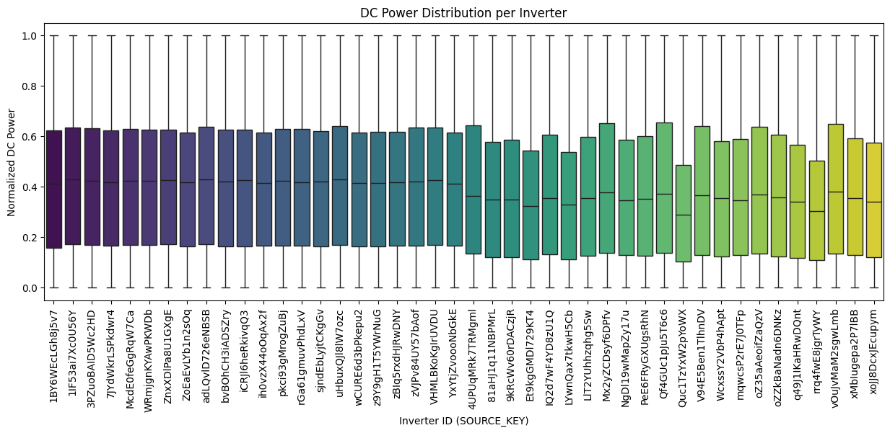
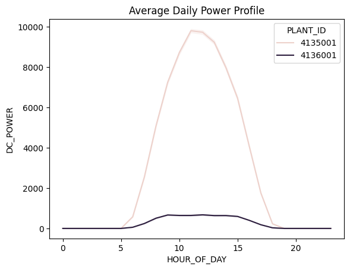
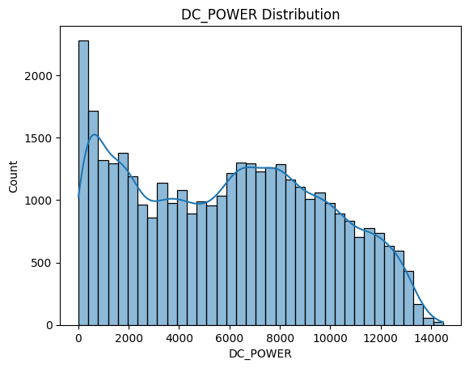
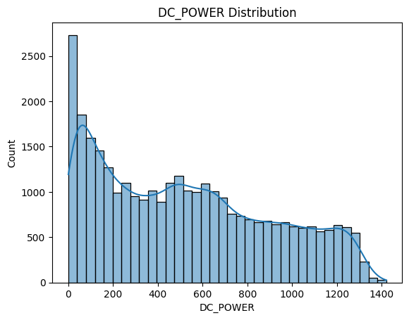

# Week 2 Progress and notes:

## Exploratory Data Analysis

First, I did some simple bad value checks

```
Data types: 
<class 'pandas.core.frame.DataFrame'>
Index: 136472 entries, 0 to 67697
Data columns (total 7 columns):
 #   Column               Non-Null Count   Dtype         
---  ------               --------------   -----         
 0   DATE_TIME            136472 non-null  datetime64[ns]
 1   DC_POWER             136472 non-null  float64       
 2   SOURCE_KEY           136472 non-null  object        
 3   PLANT_ID             136472 non-null  int64         
 4   IRRADIATION          136472 non-null  float64       
 5   AMBIENT_TEMPERATURE  136472 non-null  float64       
 6   MODULE_TEMPERATURE   136472 non-null  float64       
dtypes: datetime64[ns](1), float64(4), int64(1), object(1)
memory usage: 8.3+ MB
None

Null value counts: 
DATE_TIME              0
DC_POWER               0
SOURCE_KEY             0
PLANT_ID               0
IRRADIATION            0
AMBIENT_TEMPERATURE    0
MODULE_TEMPERATURE     0
dtype: int64

Duplicate value count: 
0
```

All checks had no issues.

Then I checked the basic statistics.
Note: Plant ID stats do not have much significance since it is an arbitrary number

|       | DATE_TIME                     | DC_POWER      | PLANT_ID     | IRRADIATION   | AMBIENT_TEMPERATURE | MODULE_TEMPERATURE |
| ----- | ----------------------------- | ------------- | ------------ | ------------- | ------------------- | ------------------ |
| count | 136472                        | 136472.000000 | 1.364720e+05 | 136472.000000 | 136472.000000       | 136472.000000      |
| mean  | 2020-06-01 09:22:57.605662464 | 1708.373962   | 4.135497e+06 | 0.230767      | 26.763066           | 31.920744          |
| min   | 2020-05-15 00:00:00           | 0.000000      | 4.135001e+06 | 0.000000      | 20.398505           | 18.140415          |
| 25%   | 2020-05-23 23:00:00           | 0.000000      | 4.135001e+06 | 0.000000      | 23.637604           | 22.411698          |
| 50%   | 2020-06-01 18:45:00           | 5.993333      | 4.135001e+06 | 0.026213      | 25.908122           | 26.413755          |
| 75%   | 2020-06-09 21:45:00           | 1155.595000   | 4.136001e+06 | 0.442961      | 29.266583           | 40.778583          |
| max   | 2020-06-17 23:45:00           | 14471.125000  | 4.136001e+06 | 1.221652      | 39.181638           | 66.635953          |
| std   | NaN                           | 3222.079306   | 4.999863e+02 | 0.305652      | 3.897340            | 11.803674          |

### Observations:

- DC_POWER is heavily skewed low:
  
  - 25% is zero
  
  - 50% is only 5.99

- Module temperature standard deviation is high

### Feature Engineering:

```python
merged_data['DC_POWER_NORM'] = merged_data.groupby('SOURCE_KEY')['DC_POWER'].transform(
    lambda x: (x - x.min()) / (x.max() - x.min()) if (x.max() - x.min()) != 0 else 0
) # Normalize DC_POWER as a percent of max power seen by specific inverter

merged_data['HOUR_OF_DAY'] = merged_data['DATE_TIME'].dt.hour # Extract the hour of day as a feature
merged_data['TEMP_DIFF'] = merged_data['MODULE_TEMPERATURE'] - merged_data['AMBIENT_TEMPERATURE'] # How much hotter the module is than the ambient temperature

merged_data_nonzero_power = merged_data[merged_data['DC_POWER'] > 0] # Dataset strictly of datapoints where DC_POWER is nonzero, since I seem to use it a lot
```

#### Comments:

- This method of normalizing DC_POWER is kind of crude and may have some flaws, but is still useful to combine the two plants
  
  - May discard data about continuously underperforming inverters, since their max is low, low values get normalized to be high

- Hour of day is useful to get a better idea of the average solar power profile

- Temperature difference is how much hotter the module is than ambient,
  
  - It could replace both ambient and module
  - I am not sure if training on all three of difference, ambient, and module would be counterproductive

### Correlation Matrix:

Useful to see how strongly a variable correlates with others to spot patterns



#### Observations:

- All the variables are strongly correlated, so it is more worth to mention the one that is not

- Ambient Temperature does not correlate strongly with DC_POWER

### Pairplot:

Useful to see everything in one graph



#### Observations:

- Not much to note that hasn't already been

- The temperature scatter plots have an odd curve shape when plotted against irradiation and themselves

### Distribution of DC_POWER per inverter:

(Kind of) a subgroup analysis

This was done with normalized DC_POWER so the graph would be more readable



#### Observations:

- You can spot some underperforming inverters that stay at a lower power level when compared to others
  
  - ID: Quc1TzYxW2pYoWX for example

- Plant 2 data (the rightmost portion of the graph) seems to have higher variance (I think this is intentional)

### Average Power Profile:

Useful to see the trend of power throughout the day, and also to show the difference between plants 1 and 2



May also be useful to graph this with normailzed DC_POWER

### DC_POWER Distributions:





#### Notes:

- This is intentionally kept seperate because normalization removes information about extreme values

- Zeroes have been removed, otherwise the data would be incredibly left biased

- There is an interesting secondary peak in both distributions around the middle 

[Link to notebook](./SolarPowerData.ipynb)

Note: Same file as week 1, due to reasons mentioned there
