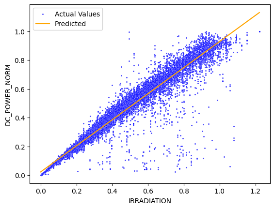

# Weeks 3 and 4: Model training and analysis

###### Because the content was closely related, I decided to merge these into one

To start out with, we do simple data preparation and train a linear regression model.

```python
# Define feature columns (X) and target variable (y)
# We use the normalized power output and include engineered features like TEMP_DIFF
x = merged_data_nonzero_power[['IRRADIATION', 'AMBIENT_TEMPERATURE', 'MODULE_TEMPERATURE', 'HOUR_OF_DAY', 'TEMP_DIFF']]
y = merged_data_nonzero_power['DC_POWER_NORM']

# Split data: 80% for training, 20% for testing
# random_state ensures reproducibility
x_train, x_test, y_train, y_test = train_test_split(x, y, test_size=0.2, random_state=69420)

# Preview the test set
display(x_test.head(), y_test.head())
```

|       | IRRADIATION | AMBIENT_TEMPERATURE | MODULE_TEMPERATURE | HOUR_OF_DAY | TEMP_DIFF |
| ----- | ----------- | ------------------- | ------------------ | ----------- | --------- |
| 7155  | 0.587753    | 27.324890           | 37.782170          | 9           | 10.457280 |
| 65072 | 0.027035    | 27.803932           | 28.582859          | 18          | 0.778928  |
| 64850 | 0.409412    | 29.934204           | 38.353782          | 15          | 8.419578  |
| 57079 | 0.559178    | 25.460364           | 37.385278          | 10          | 11.924915 |
| 66071 | 0.161417    | 27.426601           | 31.459575          | 16          | 4.032974  |

|       | DC_POWER_NORM |
| ----- | ------------- |
| 7155  | 0.628367      |
| 65072 | 0.025052      |
| 64850 | 0.443609      |
| 57079 | 0.572618      |
| 66071 | 0.151909      |



The fit here is only 'good' if we do the questionable data cleaning technique of removing all zeroes

The next step of this is to try all the data cleaning techniques, split types, and model types that make sense.

To do this, we can use something akin to a grid search

```python
split_funcs = [split_standard, split_chronological]
clean_funcs = [clean_iqr, clean_zscore, clean_modified_zscore, clean_isolation_forest]
fit_funcs = [fit_hist_gradient, fit_random_forest, fit_ridge, fit_svr]
```

For brevity, the actual definitions of the functions will not be shown, but they are in the notebook

A condensed version of the grid search (pseudocode):

```python
for split_func in split_funcs:
    # Split the data
    split_func(data)
    for clean_func in clean_funcs:
        # Remove outliers detected via the data cleaning method
        clean_func(data)
        for fit_func in fit_funcs:
            # Actually train the model
            model = fit_func(data)
            # Evaluate the model
            evaluate(model)
```

The results are visible below:

|     | RMSE     | MAE      | R2        | Data clean             | Split               | Fit               |
| --- | -------- | -------- | --------- | ---------------------- | ------------------- | ----------------- |
| 0   | 0.112343 | 0.038864 | 0.834922  | clean_zscore           | split_standard      | fit_hist_gradient |
| 1   | 0.112756 | 0.036147 | 0.833706  | clean_zscore           | split_standard      | fit_random_forest |
| 2   | 0.112785 | 0.039237 | 0.833621  | clean_iqr              | split_standard      | fit_hist_gradient |
| 3   | 0.117000 | 0.037683 | 0.820953  | clean_iqr              | split_standard      | fit_random_forest |
| 4   | 0.124305 | 0.046891 | 0.797896  | clean_isolation_forest | split_standard      | fit_random_forest |
| 5   | 0.126860 | 0.046945 | 0.789502  | clean_isolation_forest | split_standard      | fit_hist_gradient |
| 6   | 0.129665 | 0.058461 | 0.780090  | clean_iqr              | split_standard      | fit_ridge         |
| 7   | 0.129668 | 0.058358 | 0.780081  | clean_zscore           | split_standard      | fit_ridge         |
| 8   | 0.131804 | 0.060860 | 0.772776  | clean_zscore           | split_standard      | fit_svr           |
| 9   | 0.132447 | 0.062602 | 0.770555  | clean_iqr              | split_standard      | fit_svr           |
| 10  | 0.135276 | 0.044216 | 0.760647  | clean_isolation_forest | split_standard      | fit_ridge         |
| 11  | 0.153810 | 0.091762 | 0.690567  | clean_isolation_forest | split_standard      | fit_svr           |
| 12  | 0.154626 | 0.060495 | 0.581209  | clean_iqr              | split_chronological | fit_hist_gradient |
| 13  | 0.154991 | 0.060300 | 0.579225  | clean_zscore           | split_chronological | fit_hist_gradient |
| 14  | 0.155021 | 0.060060 | 0.579064  | clean_zscore           | split_chronological | fit_random_forest |
| 15  | 0.155048 | 0.060285 | 0.578917  | clean_iqr              | split_chronological | fit_random_forest |
| 16  | 0.155106 | 0.045176 | 0.685331  | clean_modified_zscore  | split_standard      | fit_ridge         |
| 17  | 0.159522 | 0.062340 | 0.554268  | clean_isolation_forest | split_chronological | fit_random_forest |
| 18  | 0.162287 | 0.061769 | 0.538681  | clean_isolation_forest | split_chronological | fit_hist_gradient |
| 19  | 0.165571 | 0.078998 | 0.519820  | clean_iqr              | split_chronological | fit_ridge         |
| 20  | 0.165646 | 0.078981 | 0.519386  | clean_zscore           | split_chronological | fit_ridge         |
| 21  | 0.169993 | 0.102077 | 0.493830  | clean_isolation_forest | split_chronological | fit_svr           |
| 22  | 0.170904 | 0.082848 | 0.488392  | clean_zscore           | split_chronological | fit_svr           |
| 23  | 0.171119 | 0.082852 | 0.487104  | clean_iqr              | split_chronological | fit_svr           |
| 24  | 0.176253 | 0.068042 | 0.455862  | clean_isolation_forest | split_chronological | fit_ridge         |
| 25  | 0.193276 | 0.063271 | 0.345681  | clean_modified_zscore  | split_chronological | fit_ridge         |
| 26  | 0.207793 | 0.107184 | 0.243694  | clean_modified_zscore  | split_chronological | fit_random_forest |
| 27  | 0.211552 | 0.109228 | 0.216083  | clean_modified_zscore  | split_chronological | fit_hist_gradient |
| 28  | 0.247590 | 0.175258 | -0.073747 | clean_modified_zscore  | split_chronological | fit_svr           |
| 29  | 0.256548 | 0.138159 | 0.139139  | clean_modified_zscore  | split_standard      | fit_random_forest |
| 30  | 0.256996 | 0.138693 | 0.136124  | clean_modified_zscore  | split_standard      | fit_hist_gradient |
| 31  | 0.295331 | 0.208935 | -0.140812 | clean_modified_zscore  | split_standard      | fit_svr           |

Of note:

- Modified z-score cleaning performs consistently worse than standard z-score

- The two tree based models performed the best (Histogram Gradient Regression, Random Forest)

- 'Chronological' split consistently perform worse than standard, this could be due to
  
  - Data leakage in the training data (i.e. predicting the past when it has been trained on future data), but the model does not have a variable representing time, so this is unlikely
  
  - New data: The model simply hasn't seen the behaviours in the latter portion of the chronological split.


