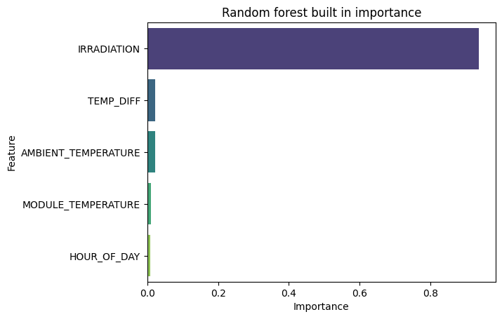
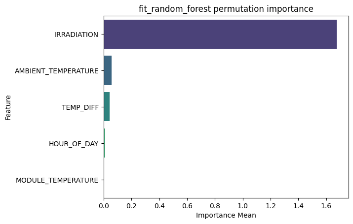
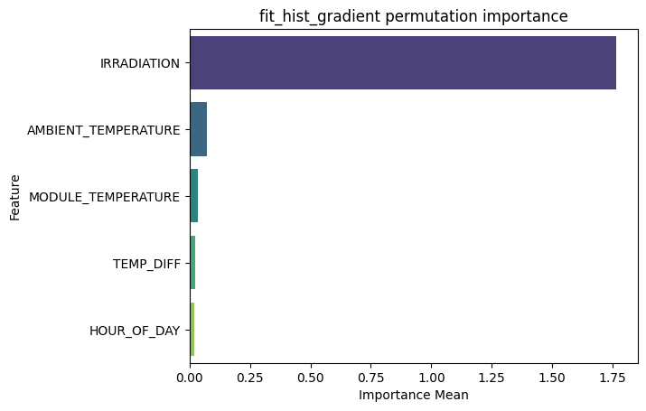
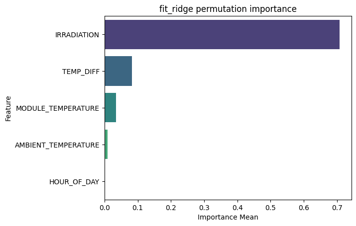
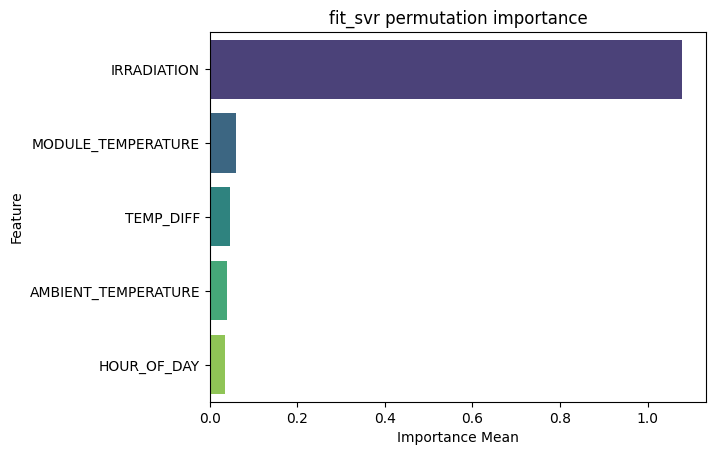

# Week 5: Evaluating feature importance

Now that we have several trained models, we can evaluate feature importance for them, to begin understanding why the model is outputting what it is.

However, only random forest directly exposes feature importance.



This model notably derives almost all of its output from irradiance.

To compare other models which do not expose feature importance directly, we instead have to find it using permutation importance.

The code for that, in pseudocode, is:

```python
for fit_func in fit_funcs:
  model = fit_func(data)

  permutation_importance_out = permutation_importance(model, data)
```

Random Forest permutation importance:



While the raw values of the random forest permutation importance seem to be doubled, the relative weights of each variable remain roughly the same. Permutation importance oddly does miss the impact of MODULE_TEMPERATURE on the output though.

Remaining permutation importances







All the models agree that IRRADIATION is the primary feature in determining output. However, the worse performing models (which happen to be linear) seem to weight the remaining features higher. We may consider sourcing alternative weather data in the future.
