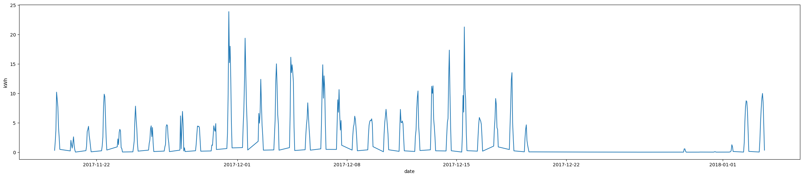
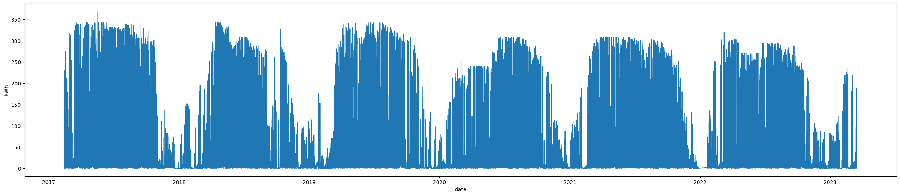

# Week 6: New dataset ([Dataset](https://www.kaggle.com/datasets/ivnlee/solar-energy-production))

The last dataset was flawed, as it only contained data for two months (May & June). To get a better idea of how the model will perform in real world conditions and introduce seasonal variations, we picked a new dataset that covered multiple years of data.

To begin working with the dataset, we need to understand it. Some basic information:

- Site count: 11

- Global date range: 9/11/2017 - 3/12/2023

Each individual building does not have data for the entire timespan.

| name                                      | start_date          | end_date            |
| ----------------------------------------- | ------------------- | ------------------- |
| Bearspaw Water Treatment Plant            | 2017-11-21 10:45:00 | 2023-03-16 19:00:00 |
| CFD Firehall #7                           | 2017-09-21 07:00:00 | 2023-03-16 19:00:00 |
| Calgary Fire Hall Headquarters            | 2016-11-24 14:00:00 | 2023-03-16 19:00:00 |
| City of Calgary North Corporate Warehouse | 2016-12-23 09:30:00 | 2023-03-16 19:00:00 |
| Glenmore Water Treatment Plant            | 2017-03-08 10:00:00 | 2023-03-12 17:00:00 |
| Hillhurst Sunnyside Community Association | 2016-10-03 13:00:00 | 2023-03-15 19:00:00 |
| Manchester Building M                     | 2017-10-05 13:15:00 | 2023-03-16 19:00:00 |
| Richmond - Knob Hill Community Hall       | 2016-12-09 11:00:00 | 2023-03-16 19:00:00 |
| Southland Leisure Centre                  | 2015-09-01 14:30:00 | 2023-03-16 18:00:00 |
| Telus Spark                               | 2017-11-19 08:00:00 | 2018-01-03 16:00:00 |
| Whitehorn Multi-Service Centre            | 2017-02-13 09:45:00 | 2023-03-16 19:00:00 |

For now, we pick one building to focus on, because each building has a different production capacity, and some have gaps or wierd data.

Telus Spark, as an extreme example:

In the end, we selected Whitehorn Service centre due to the amount of data and relative absence of gaps in the data.

