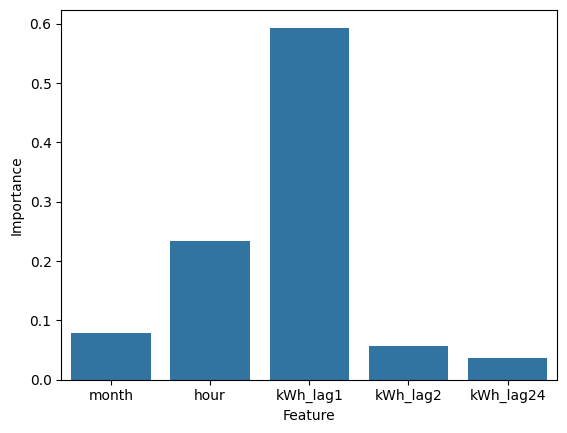

# Week 7: Basic model training on new dataset + lag features

First, we investigate the odd spike power production during the late hours of the day in autumn.

```python
# Find out about the wierd spike in late hours for autumn.
target = df_autumn[(df_autumn.index.hour > 20) & (df_autumn.kWh > 1)]
display(target)
```

|                     | name                     | id     | address              | date                | kWh    | public_url                                        | installationDate | uid                       | month | hour | day |
| ------------------- | ------------------------ | ------ | -------------------- | ------------------- | ------ | ------------------------------------------------- | ---------------- | ------------------------- | ----- | ---- | --- |
| date                |                          |        |                      |                     |        |                                                   |                  |                           |       |      |     |
| 2015-09-01 21:30:00 | Southland Leisure Centre | 164440 | 2000 SOUTHLAND DR SW | 2015-09-01 21:30:00 | 57.844 | https://monitoring.solaredge.com/solaredge-web... | 2015/09/01       | 1644402015-09-01 21:30:00 | 9     | 21   | 1   |
| 2015-09-01 22:30:00 | Southland Leisure Centre | 164440 | 2000 SOUTHLAND DR SW | 2015-09-01 22:30:00 | 48.606 | https://monitoring.solaredge.com/solaredge-web... | 2015/09/01       | 1644402015-09-01 22:30:00 | 9     | 22   | 1   |
| 2015-09-01 23:30:00 | Southland Leisure Centre | 164440 | 2000 SOUTHLAND DR SW | 2015-09-01 23:30:00 | 31.482 | https://monitoring.solaredge.com/solaredge-web... | 2015/09/01       | 1644402015-09-01 23:30:00 | 9     | 23   | 1   |
| 2015-09-02 21:30:00 | Southland Leisure Centre | 164440 | 2000 SOUTHLAND DR SW | 2015-09-02 21:30:00 | 35.959 | https://monitoring.solaredge.com/solaredge-web... | 2015/09/01       | 1644402015-09-02 21:30:00 | 9     | 21   | 2   |
| ...                 | ...                      | ...    | ...                  | ...                 | ...    | ...                                               | ...              | ...                       | ...   | ...  | ... |

Seems like the majority of the content is from Southland Leisure Centre.

This is safe to ignore, since we aren't using data from that building anyway.

Before we train the model, some data preprocessing is necessary to generate lag features and improve model accuracy:

```python
data['hour_sin'] = sin(2 * pi * data['hour'] / 24.0)
data['hour_cos'] = cos(2 * pi * data['hour'] / 24.0)

data['month_sin'] = sin(2 * pi * data['hour'] / 12.0)
data['month_cos'] = cos(2 * pi * data['hour'] / 12.0)

data['kWh_lag1'] = data['kWh'].shift(1)
data['kWh_lag2'] = data['kWh'].shift(2)

data['kWh_lag24'] = data['kWh'].shift(24)

data['DOY'] = data.date.dt.dayofyear - 1
data = data.copy()

data['DOY_sin'] = sin(2 * pi * data['hour'] / 365.0)
data['DOY_cos'] = cos(2 * pi * data['hour'] / 365.0)

data = data.iloc[24:]
```

Lag steps were picked for illustrative purposes, not optimized.

Here you can see various sets of features used, followed by the RMSE, R2, and MAE of the model respectively.

```python
x = data[['month_sin', 'month_cos', 'DOY_sin', 'DOY_cos', 'hour_sin', 'hour_cos', 'kWh_lag1', 'kWh_lag2', 'kWh_lag24']] # 36.254364760678094 0.8248486389497924 23.46417641279728
x = data[['month', 'DOY', 'hour', 'kWh_lag1', 'kWh_lag2', 'kWh_lag24']] # 31.12005383704525 0.8705738726313695 18.335540267154105
x = data[['month', 'DOY', 'hour']] # 60.92139135385213 0.504242367929508 38.9335652916937
x = data[['month', 'hour', 'kWh_lag1', 'kWh_lag2', 'kWh_lag24']] # 31.564038317246762 0.8667215192040549 18.660708832684822
```

Of note:

Lag steps dramatically improve model accuracy, because of a lack of weather data.

This is backed up by feature importance:



The model primarily relies on power production from one hour ago.

Sin and Cos transforms seem to decrease model performance and are not necessary for this type of model, so we can just not use them for now.

To get a vague idea of model accuracy we can check the range of data and compare it to RMSE.

```python
print(ptp(data.kWh))
```

```sh-session
319.293
```

In short: this model is not very good.


